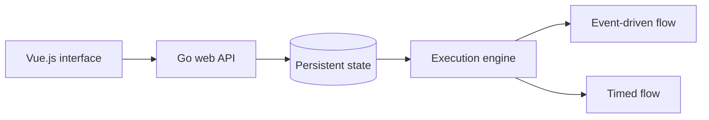

# Project Overview

This project is a home automation flow engine with a graphical flow designer.

It must support these deployment modes:

- A Docker container running as a Home Assistant add-on.
- A standalone Docker container communicating through the Home Assistant API or an external MQTT broker.

## Flow Designer

The Vue.js interface allows users to create and deploy graphical logic flows. An older version of the Vue.js designer is available in `../HtmlSvg` for reference.

### Frontend migration workflow

The restartable migration plan is maintained in `.codex/ui-migration-plan.md`.
Read it before starting Vue migration work and resume from the first unchecked
slice whose prerequisites are complete. Update its checklist and handoff log as
part of every completed slice.

Do not copy legacy Vue architecture merely to preserve its shape. Preserve useful
behaviour while implementing it with the current UI project's Vue, Vue Router,
Pinia, TypeScript, accessibility, and testing patterns.

Every frontend migration slice must:

- comply with `frontend/flow-control-ui` formatting and lint rules;
- add or update unit tests for migrated logic and component behaviour;
- add or update Playwright e2e tests for migrated user-visible behaviour;
- keep existing unit and e2e tests passing; and
- pass format, lint, unit test, e2e test, type-check, and production build checks
  before its checklist item is marked complete.

## Frontend lint and formatting

For every change under `frontend/flow-control-ui`:

- Follow the rules in `eslint.config.ts`, including expression-style functions,
  explicit TypeScript return types, alias imports across directories, and Vue
  block ordering.
- Run `npm run format` and then `npm run lint` from
  `frontend/flow-control-ui` after editing.
- Treat formatter and linter auto-fixes as source changes: inspect the resulting
  diff, revert unrelated rewrites, and rerun both commands until they exit
  successfully.
- Run the relevant tests and `npm run build` after lint passes. Do not report a
  frontend change as complete while formatting, lint, tests, type-checking, or the
  production build fails.

The backend executes deployed flows in one of two ways:

1. In response to events, such as MQTT messages.
2. On a timed loop at a configured interval.

Flows may communicate with home automation controllers through their supported protocols or through Home Assistant.

## Technology Stack

- Go backend for the server API and automation engine.
- Vue.js frontend with SVG components for the graphical flow designer.

## Execution Architecture

The backend must manage multiple independent flows concurrently.



When a flow is deployed, the backend starts an isolated runtime for it. Each runtime must support execution, updates, and graceful shutdown without affecting other flows.

## Go Design Rationale

Go provides the required concurrency and type safety:

- Goroutines allow independent flows to run with low overhead.
- Channels, `select`, and tickers support event-driven execution, timed execution, and graceful shutdown.
- Typed structures provide validation when mapping frontend JSON flow graphs to backend models.

Conceptual flow runner:

```go
go func() {
	ticker := time.NewTicker(5 * time.Minute)
	defer ticker.Stop()

	for {
		select {
		case <-ticker.C:
			executeFlowLogic()
		case message := <-mqttChannel:
			executeMqttLogic(message)
		case <-stopChannel:
			return
		}
	}
}()
```
