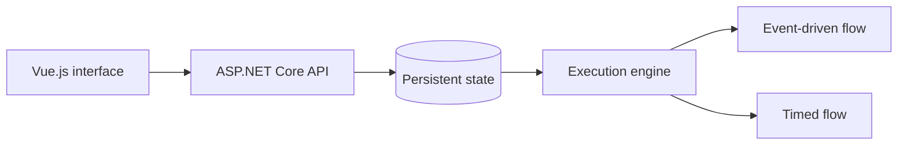

# Project Overview

This project is a home automation flow engine with a graphical flow designer.

## Pre-release version policy

The product has no deployed user flows and is not yet used in the wild. Keep
explicit schema, IL, protocol, and ABI version fields so unsupported input is
rejected clearly, but implement only the current version. Do not add migration
adapters, fallback decoders, old aliases, dual-write behavior, compatibility
windows, or decompiler support for superseded formats during pre-release
development. When a format is replaced, update fixtures and all producers and
consumers together, then remove the superseded implementation and tests.

Backward compatibility begins only after a separately recorded production
release milestone establishes real persisted/deployed data. At that point it
must be introduced deliberately with a documented support window and removal
plan; do not infer that obligation from pre-release version numbers.

It must support these deployment modes:

- A Docker container running as a Home Assistant add-on.
- A standalone Docker container communicating through the Home Assistant API or an external MQTT broker.

## Flow Designer

The Vue.js interface allows users to create and deploy graphical logic flows.

Do not introduce alternate Vue architectures or old wire aliases. Preserve useful
behaviour while implementing it with the current UI project's Vue, Vue Router,
Pinia, TypeScript, accessibility, and testing patterns.

Every frontend migration slice must:

- comply with `frontend/flow-control-ui` formatting and lint rules;
- add or update unit tests for migrated logic and component behaviour;
- add or update Playwright e2e tests for migrated user-visible behaviour;
- keep existing unit and e2e tests passing; and
- pass format, lint, unit test, e2e test, type-check, and production build checks
  before its checklist item is marked complete.

## Frontend lint and formatting

For every change under `frontend/flow-control-ui`:

- Follow the rules in `eslint.config.ts`, including expression-style functions,
  explicit TypeScript return types, alias imports across directories, and Vue
  block ordering.
- Run `npm run format` and then `npm run lint` from
  `frontend/flow-control-ui` after editing.
- Treat formatter and linter auto-fixes as source changes: inspect the resulting
  diff, revert unrelated rewrites, and rerun both commands until they exit
  successfully.
- Run the relevant tests and `npm run build` after lint passes. Do not report a
  frontend change as complete while formatting, lint, tests, type-checking, or the
  production build fails.

## Frontend end-to-end test organisation

- Segregate Playwright tests into separate spec files by user-facing function.
  Keep library management, runtime/deployment, designer nodes, connections,
  toolbox, and configuration behaviours in their own clearly named files; do
  not accumulate unrelated feature groups in a general-purpose route spec.
- Each test must verify one independently meaningful behaviour. Do not combine
  create, rename, delete, deployment success, deployment failure, or unrelated
  accessibility behaviours into one long scenario merely to reuse setup.
- Extract repeated route mocks and setup into narrowly scoped helpers or
  fixtures. Every test must receive fresh mutable state and must be runnable by
  itself without relying on another test's side effects or execution order.
- Comment non-obvious tests generously. Use Arrange, Act, and Assert comments to
  explain the user contract, why unusual event synthesis or mocking is needed,
  and what regression each important assertion prevents. Do not add comments
  that only restate an immediately obvious Playwright call.
- Prefer role- and label-based locators. Keep direct CSS/SVG selectors limited to
  graph details that do not expose an accessible locator.

The backend is the authoritative compiler and the first production execution
host. It compiles an immutable resolved flow snapshot into versioned Flow IL;
the same portable VM executes that IL on the server and supported hardware
controllers. Target devices must not compile designer graphs or independently
define node semantics. The detailed roadmap is in
`docs/portable-flow-il-architecture.md`.

Deployed flows execute in one of two ways:

1. In response to events, such as MQTT messages.
2. On a timed loop at a configured interval.

Flows may communicate with home automation controllers through their supported protocols or through Home Assistant.

## Technology Stack

- ASP.NET Core backend for the server API and automation engine.
- Vue.js frontend with SVG components for the graphical flow designer.

## Execution Architecture

The backend must manage multiple independent flows concurrently.
Each flow independently uses the normative PLC Scan Cycle from
`docs/plc-scan-cycle.md`: Read Inputs, Execute Logic, then Write Outputs. Inputs
and current state are frozen for a scan; logic stages changes privately; only a
successful final phase publishes next state, proposed commands, and a snapshot.
Do not introduce mid-scan I/O, overlapping scans, recursive graph evaluation,
or implicit cycle breaking in any host or future runtime phase.


```mermaid
flowchart LR
    UI[Vue.js interface] --> API[ASP.NET Core API]
    API --> State[(Persistent state)]
    State --> Engine[Execution engine]
    Engine --> EventFlow[Event-driven flow]
    Engine --> TimedFlow[Timed flow]
```

When a flow is deployed to the built-in target, the backend compiles and starts
an isolated portable-VM runtime for it. Each runtime must support execution,
transactional replacement, and graceful shutdown without affecting other flows.

## .NET Design Rationale

.NET provides the required concurrency and type safety:

- Hosted services and asynchronous tasks allow independent flows to run with low overhead.
- `CancellationToken`, channels, and `PeriodicTimer` support event-driven execution, timed execution, and graceful shutdown.
- Typed structures provide validation when mapping frontend JSON flow graphs to backend models.

Conceptual flow runner:

```csharp
using var timer = new PeriodicTimer(TimeSpan.FromMinutes(5));

while (!stoppingToken.IsCancellationRequested)
{
    await timer.WaitForNextTickAsync(stoppingToken);
    await ExecuteFlowLogicAsync(stoppingToken);
}
```
